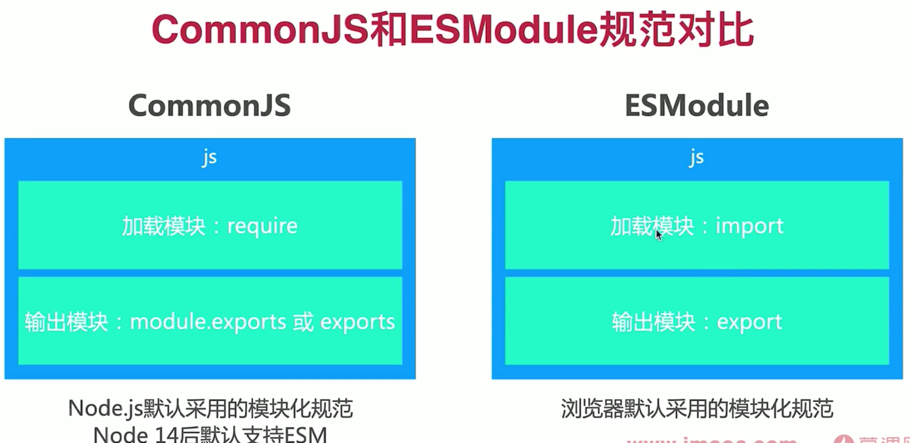

1. Esmodule设计理念是希望在编译时就确定模块依赖关系及输入输出
2. commonjs和AMD必须在运行时才能确定依赖和输入/输出
3. ESM通过import加载模块,通过export输出模块
4. node14后默认支持ESM

### CommonJS和ESModule规范对比
1. commonjs模块输出的是值的拷贝, ES6模块输出的是值的引用
2. commonjs模块是运行时加载, es6模块是编译时输出接口
3. commonjs是单个值到处, es6 module可以导出多个 
4. commonjs模块是同步加载的,es6 module支持异步加载
5. commonjs的this是当前模块, es6 module的this是undefined
6. 
