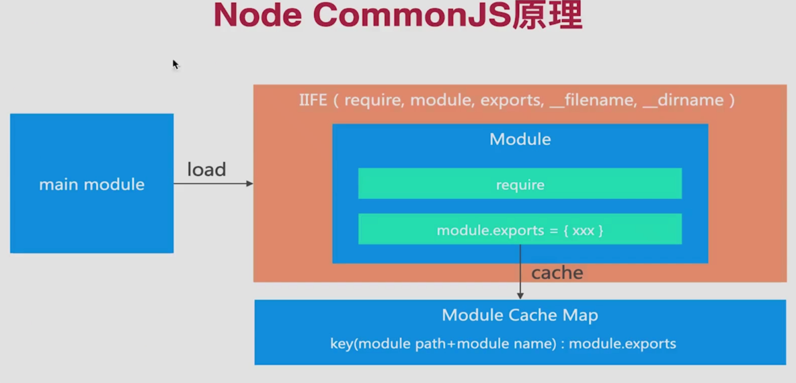

1. NodeJS默认模块化规范,每个文件就是一个模块,有自己的作用域
2. Node中CJS模块加载采用同步加载方式
3. 通过require加载模块,通过exports或module.exports输出模块
4. 所有代码都运行在模块作用域,不会污染全局作用域
5. 模块可以多次加载,第一次加载时会运行模块,模块输出结果会被缓存,再次加载时,会从缓存结果中直接读取模块并执行
6. 模块加载的顺序, 按照其在代码中出现的顺序
7. 模块输出的值是值的拷贝 (值是输出模块闭包中的变量,你在输入模块中是无法改变其变量值的)
8. 在模块中使用require方法是怎么来的? -- commonjs规范是在模块中会有个自执行函数,通过函数入参的方式传入,如require,module等
9. commonjs模块导出的是一个map键值对  `key(module_path + module_name): module.exports`
10. commonJS只能输出一个结果, 不像esModule可以输出多个
11. commonJS原理图 
12. 
