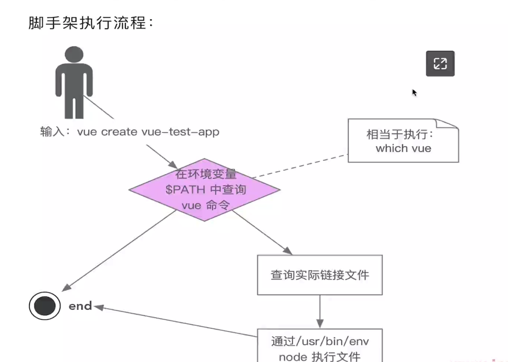

### 前端脚手架
#### 1. 为什么要前端脚手架?
...
#### 2. 脚手架执行流程

* 操作系统环境变量
* 软链接(在windows上称之为快捷方式)
* vue,which,env,node本质都是脚手架

#### 3. Unix (Linux, Macos) 文件权限体系
* bin: rwx r-x r-x ``` ls -al ```
* r: 读, w:写, x:执行
* u: 当前登录用户 g:当前登录用户所在分组 o:其他用户
* Unix使用32位二进制数存储文件类型和权限 (在Unix中所有都是文件,不管是文件还是http协议等等)

    | 0000 0000 0000 0000 |    |
    |---------------------|----|
    | 前四位 0000            | 文件类型 |
    | 后三位 000             | 特殊权限 |
    | 后三位 000             | 用户权限 |
    | 后三位 000             | 分组权限 |
    | 最后三位 000             | 其他权限 |

#### 4. 自定义脚手架
* 脚本上方要写上 ```#! /usr/bin/env node```,防止shell工具不能识别
* 本地调试要执行```npm link```,否则会报找不到命令
* 启动node子进程的好处, 子进程启动不会影响主进程, 子进程启动可以方便重启(解决配置修改后无法重启的问题)


 
